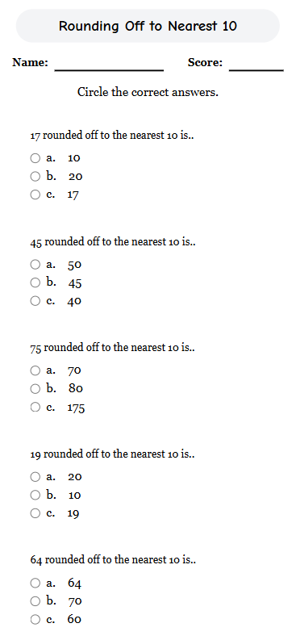

#  Rounding Off to Nearest 10 – Worksheet Web App

An interactive math worksheet built with **React** and **Tailwind CSS**, designed to help users practice rounding numbers to the nearest 10 which is fully optimized for mobile and web use.

## Features
### V1 (main branch)
- ✅ Mobile-first responsive layout
- ✅ Styled with Tailwind CSS
- ✅ Deployable to Netlify, Vercel, or GitHub 

### V2
- ✅ Mobile-first responsive layout
- ✅ Styled with Tailwind CSS
- ✅ Clean component-based React structure